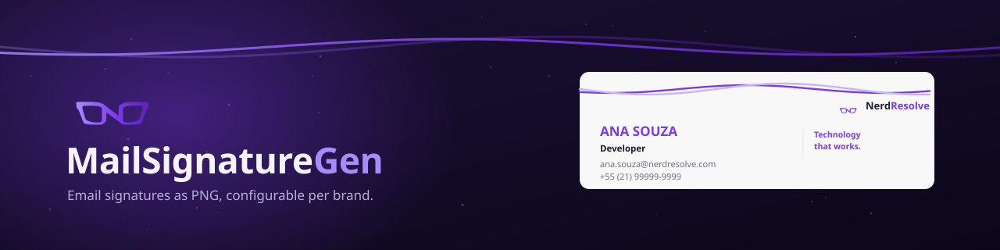
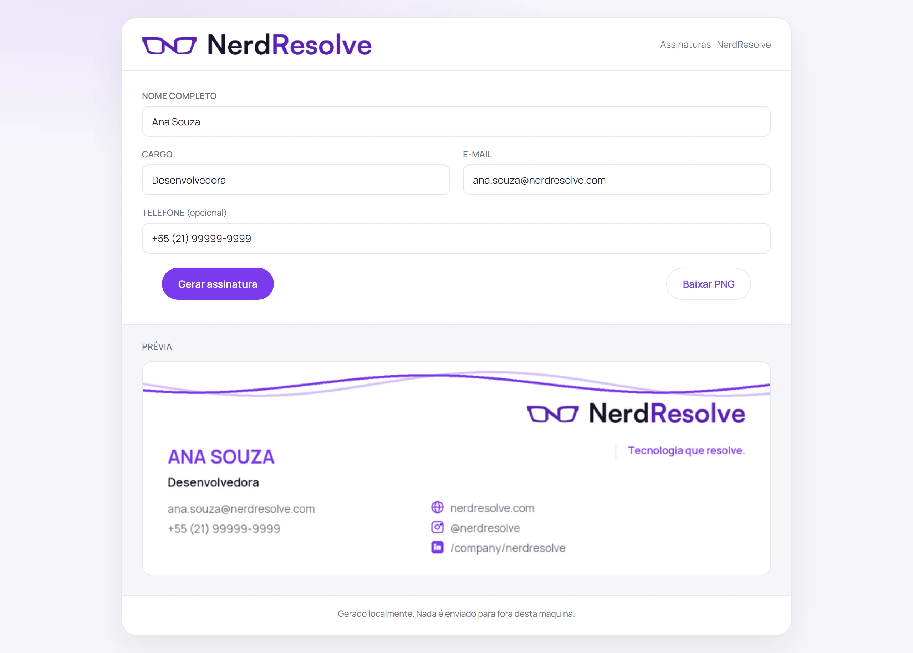
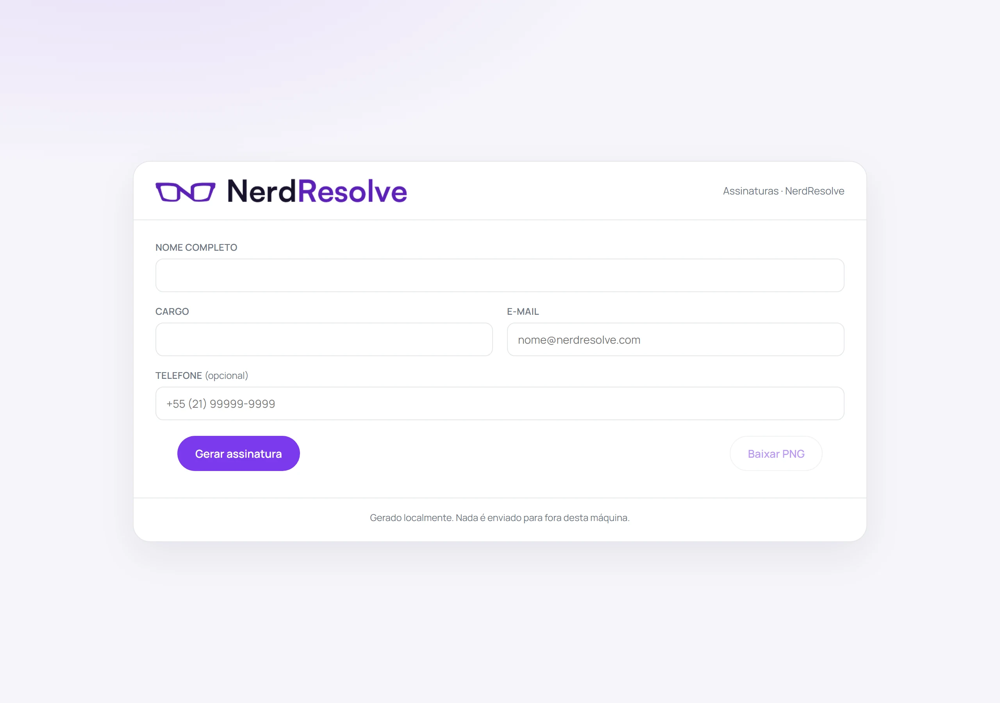
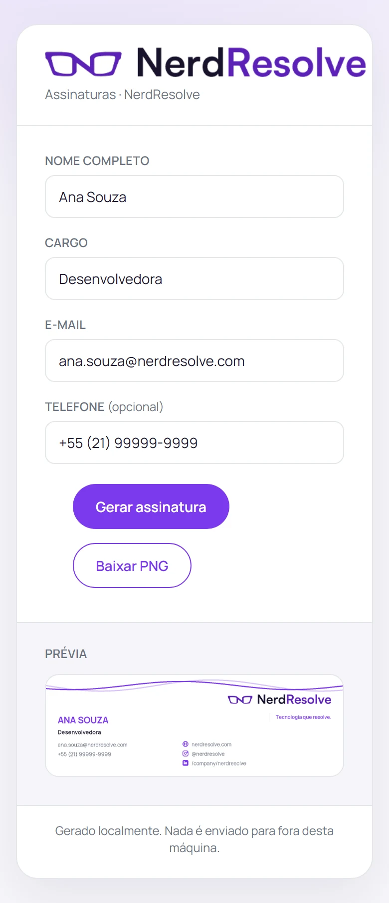

<div align="center">



Um gerador de assinaturas de e-mail que a sua equipe usa sozinha.
Cada pessoa preenche quatro campos e baixa o PNG; ninguém abre o Photoshop.

[](LICENSE.md)   

[As telas](#as-telas) · [Como funciona](#como-funciona) · [Rodar](#rodar) · [Configurar a sua marca](CONFIGURACAO.md) · [Licença](#licença)

</div>

---

## O que é

Toda empresa que padroniza assinatura de e-mail cai no mesmo lugar: um `.psd` no
drive, um pedido para o time de design a cada pessoa nova, e três versões
diferentes circulando ao mesmo tempo.

Aqui a assinatura é **desenhada por código** a partir de um arquivo de
configuração. Quem entra preenche nome, cargo, e-mail e telefone, e recebe o PNG
pronto. Quem cuida da marca edita um JSON e troca o logo — e a assinatura de
todo mundo muda junto.

O repositório vem com a marca da **NerdResolve** como exemplo funcional. Ela é o
modelo a copiar, não algo a remover.

<div align="center">

</div>

---

## Como funciona

Não existe template de imagem. A assinatura é composta do zero a cada
requisição, e é isso que a torna configurável:

```
brands/suaempresa/brand.json     cores, tipografia, redes, perfis
brands/suaempresa/logo.png       o logotipo, e só ele
         │
         ▼
  app/brand.py       valida e resolve: cor vira RGB, caminho vira absoluto
         │
         ▼
  app/render.py      empilha os blocos e desenha com Pillow
         │
         ▼
  assinatura.png     800×260, ~40 kB
```

### Três decisões que valem registro

**Nada de template achatado.** A versão anterior abria um PNG pronto, pintava
retângulos brancos sobre os dados de quem posou de exemplo e reescrevia o texto
por cima. Funcionava, com dois custos: trocar de cliente exigia editor de imagem
e coordenadas novas, e o PNG carregava para o repositório o nome, o e-mail e o
telefone de uma pessoa real. Desenhar do zero resolve os dois de uma vez.

**A altura é um mínimo, não um teto.** Um nome comprido encolhe até 85% e, se
ainda assim não couber, quebra em duas linhas — e a imagem cresce para acomodar.
Truncar não é opção: é o nome de uma pessoa. Há teste medindo que nada é
desenhado fora da área visível, porque o Pillow corta em silêncio.

**Os ícones das redes são desenhados a traço**, não carregados de uma fonte de
ícones. A versão anterior usava Font Awesome via CDN, que resolve o HTML e não
alcança o Pillow — e uma assinatura de e-mail precisa da imagem, não da página.
São ~40 linhas de geometria, e o projeto não depende de rede para gerar.

---

## As telas

<table>
<tr>
<td width="50%"><a href="docs/telas/01-formulario.webp"></a><br><sub><b>Formulário</b> · quatro campos, e o cargo tem sugestões</sub></td>
<td width="50%"><a href="docs/telas/02-previa.webp"></a><br><sub><b>Prévia</b> · a imagem final, antes de baixar</sub></td>
</tr>
</table>

<div align="center">
<a href="docs/telas/03-celular.webp"></a><br><sub><b>No celular</b> · a mesma tela, em uma coluna</sub>
</div>

> Não são mockups: é a aplicação rodando. `python tools/shots.py` sobe o
> servidor, abre cada tela no Chromium e salva o que aparece.

A interface se pinta com as cores da marca carregada. Trocar `cores.marca` no
JSON muda a assinatura **e** a página.

---

## Rodar

Você precisa de **Python 3.10+** e **Node 18+**.

```bash
npm run setup          # instala as dependências dos dois lados
npm start              # http://localhost:3000
```

No Windows, `SignatureGeneratorRun.bat` faz os dois passos e abre o navegador.
No Linux e no macOS, `./SignatureGeneratorRun.sh`.

### Sem subir servidor

A linha de comando gera direto, o que serve para lote a partir de um CSV:

```bash
python -m app.cli --nome "Ana Souza" --cargo "Desenvolvedora" \
  --email "ana.souza@nerdresolve.com" --telefone "+55 (21) 99999-9999" \
  --saida ana.png
```

```bash
python -m app.cli --listar        # as marcas instaladas
```

### Os testes

```bash
npm test               # 43 testes, tudo offline
```

Eles cobrem o que a configuração aceita e recusa, e as propriedades do desenho:
o tamanho contratado, a tinta dentro da área útil, o texto que não invade a
coluna vizinha.

---

## Configurar a sua marca

O passo a passo está em **[CONFIGURACAO.md](CONFIGURACAO.md)**. O resumo:

```bash
mkdir brands/suaempresa
cp brands/nerdresolve/brand.json brands/suaempresa/brand.json
cp seu-logo.png brands/suaempresa/logo.png
# edite o JSON: nome, cores, redes
BRAND=suaempresa npm start
```

O que dá para mudar sem tocar em código:

| | |
|---|---|
| **Cores** | Uma cor de marca pinta nome, ícones, slogan, faixa — e a interface |
| **Logo** | Um PNG e a altura desejada; a largura segue a proporção |
| **Tipografia** | Peso, tamanho e cor de cada campo |
| **Faixa do topo** | `onda`, `barra` ou `nenhuma` |
| **Redes sociais** | Site, Instagram, LinkedIn — ou nenhuma |
| **Perfis** | Variações de cor e logo dentro da mesma marca |
| **Cargos** | A lista que vira sugestão no formulário |

Configuração inválida é recusada citando o campo (`cores.marca: 'roxo' não é
hexadecimal de seis dígitos`), não com um erro de Python.

---

## Por dentro

```
app/
  brand.py         lê e valida o brand.json; devolve valores resolvidos
  render.py        o desenho: faixa, logo, três colunas de texto, ícones
  cli.py           linha de comando, e é o que o servidor chama
  server.js        Express: serve a interface e expõe /api
  public/          a interface, um HTML sem framework
brands/
  nerdresolve/     a marca de exemplo
assets/fonts/      Manrope (SIL Open Font License)
tests/             43 testes
tools/shots.py     as capturas deste README
docs/              banner e telas
```

O servidor não sabe desenhar: ele valida a entrada e chama a CLI. Assim o
layout existe em um lugar só, em vez de ter uma versão em Python e outra em
JavaScript para manter em acordo.

### Escolhas de arquitetura

| Decisão | Por quê |
|---|---|
| **Pillow, não headless browser** | Um Chromium para desenhar 800×260 custa ~400 MB e alguns segundos de arranque. O Pillow resolve em ~200 ms com uma dependência |
| **Python desenha, Node serve** | Cada um no que já é bom. O preço é um subprocesso por requisição — irrelevante nesta escala |
| **A fonte acompanha o repositório** | Assinatura que depende de fonte do sistema sai diferente em cada máquina. A Manrope é OFL: pode ser redistribuída |
| **Sem banco de dados** | Nada é gravado. O que a pessoa digita vira imagem e vai embora |
| **Interface sem framework** | Um formulário de quatro campos não justifica um build. É HTML servido direto |

---

## Pendências conhecidas

- **A prévia é a imagem final.** Não há edição interativa: para ajustar, mude o
  campo e gere de novo.
- **Três redes sociais.** `site`, `instagram` e `linkedin` têm ícone próprio;
  qualquer outra recebe o globo. Adicionar uma é escrever a geometria em
  `_icone_social`.
- **Sem saída em HTML.** A assinatura é PNG. Uma versão em HTML com links
  clicáveis seria melhor em alguns clientes de e-mail, e não existe ainda.
- **O layout é um só.** Colunas, ordem e posições são fixas; o que muda é cor,
  tipografia, logo e conteúdo. Um segundo arranjo exigiria código.

---

## Licença

**MIT.** Veja [LICENSE.md](LICENSE.md). Use, modifique e distribua, inclusive
comercialmente.

A licença cobre o código. A marca **NerdResolve** — o nome, o logotipo e os
arquivos em `brands/nerdresolve/` — não está incluída: ao usar este projeto,
troque pela sua. A Manrope tem licença própria, a
[SIL OFL](assets/fonts/OFL.txt), que permite redistribuição.

---

<div align="center">


Desenvolvido por [NerdResolve](https://nerdresolve.com)

Precisa de algo assim na sua empresa? **contact@nerdresolve.com**

</div>
